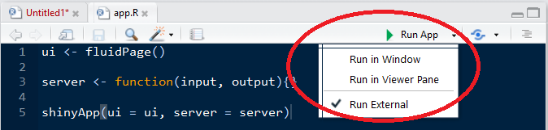
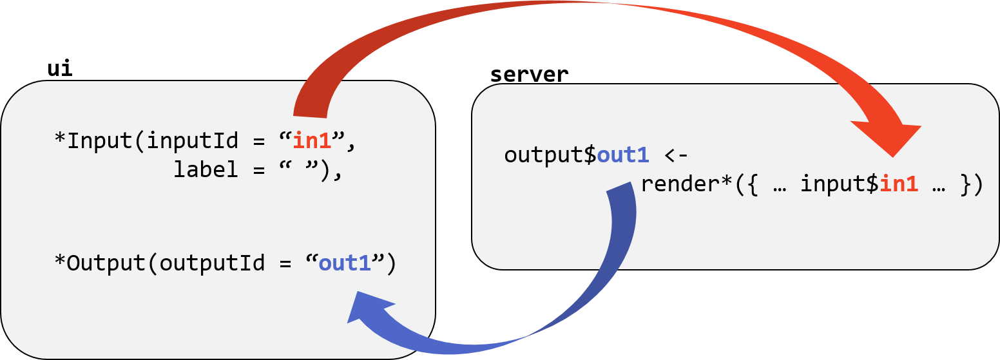
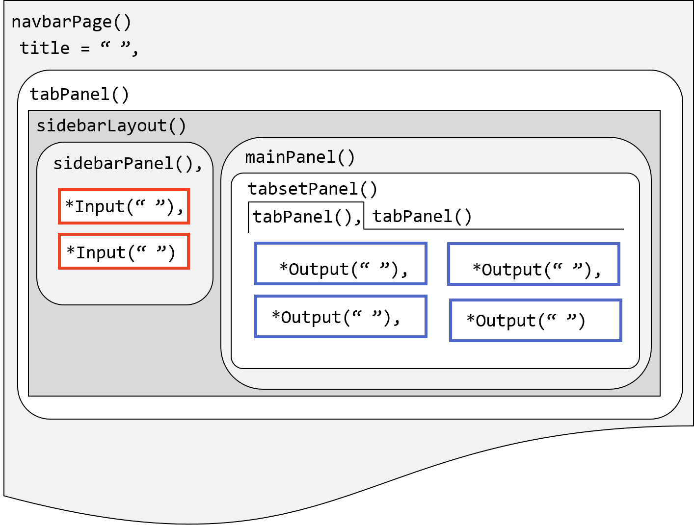
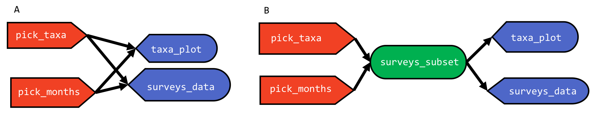
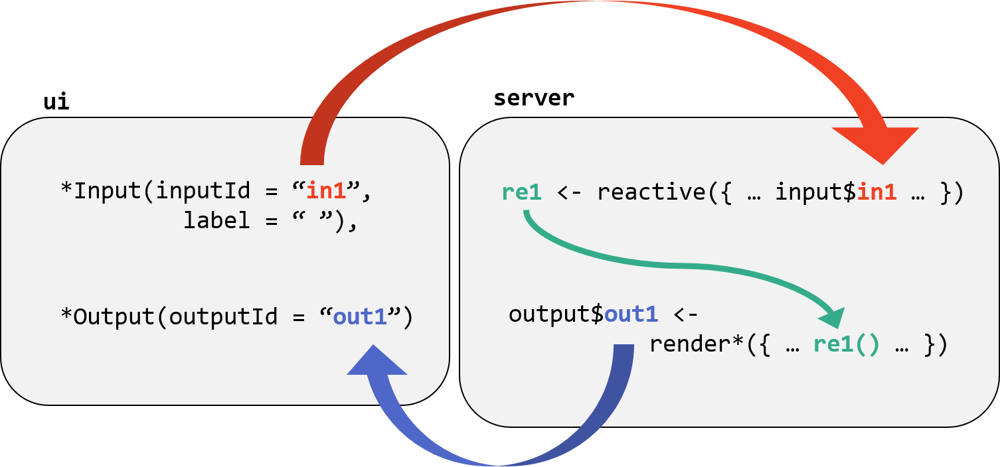
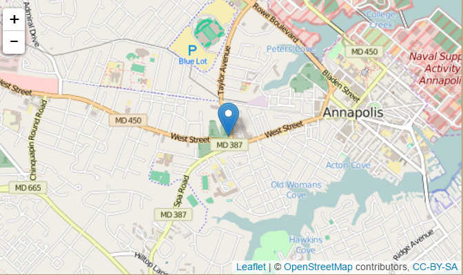
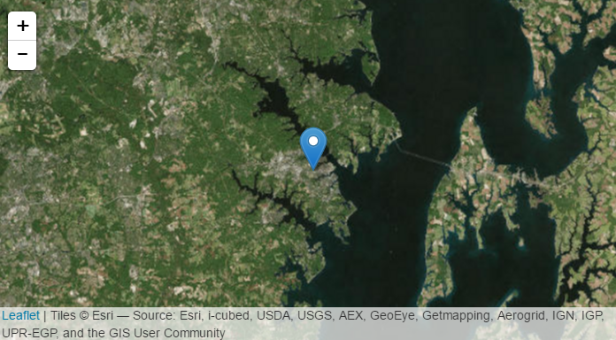
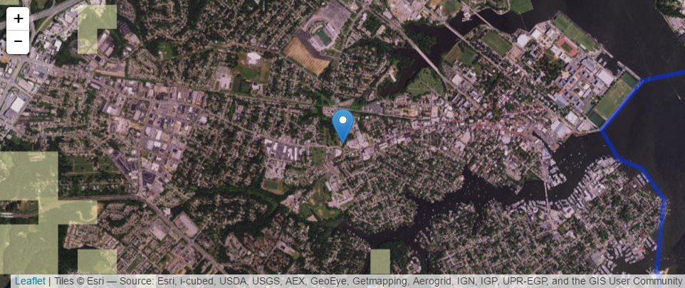

  
# Introduction

This lesson presents an introduction to creating interactive web applications using the R [Shiny](https://cran.r-project.org/web/packages/shiny/index.html) package. It covers:

* The basic building blocks of a Shiny app
* How to create customized interactive elements and arrange them on a page
* Using [Leaflet](https://rstudio.github.io/leaflet/) to put a map in a Shiny app

It uses parts of the [Portals teaching database](https://github.com/weecology/portal-teachingdb)

This lesson builds on concepts covered in the [data manipulation](https://github.com/SESYNC-ci/ci-spring2016/blob/master/Lessons/tidyr_dplyr.md) and [geospatial](https://github.com/SESYNC-ci/ci-spring2016/blob/master/Lessons/geospatial.md) lessons and requires the `shiny`, `dplyr`, and `leaflet` libraries. 

You can see the final version of the app that we will make [here](https://shiny.sesync.org/apps/csi-spring2016/).

# What is Shiny?

Shiny is a web application framework for R that allows you to create interactive web apps without requiring HTML, CSS, or JavaScript. These web apps can be used for exploratory data analysis and visualization, to facilitate remote collaboration, share results, and [much more](http://shiny.rstudio.com/gallery/). 

The `shiny` package includes some built-in examples to demonstrate some of its basic features. When applications are running, they are displayed in a separate browser window or the RStudio Viewer pane. 

> Load the shiny package and run one of the [built-in examples](http://shiny.rstudio.com/tutorial/lesson1/#Go Further):

```{r, eval=FALSE}
library(shiny)
runExample("01_hello")
```

The example will open in a new browser window (you may need to prevent your broswer from blocking pop-out windows in order to view the app). Notice back in RStudio that a stop sign that appears in the Console window while your app is running. This is because the current R session is busy running your application. Closing the app window does not stop the app from using your R session. *Make sure to end the app when you are finished by clicking the stop sign.* 

## File structure

Depending on the purpose and computing requirements of any Shiny app, you may set it up to run R code on your computer, a remote server, or in the cloud. However all Shiny apps consists of the same two main components:

* The **user interface (UI)** which defines what users will see in the app and its design.
* The **server** which defines the instructions for how to assemble components of the app like plots and input widgets.

These components can be defined either in two separate files called `ui.R` and `server.R` saved in the same folder, or they can be defined as objects called `ui` and `server` within one file called `app.R`. 

The appearance of the web page (the UI) is controlled by the computer running a live R session. When you are using standalone RStudio, that session is running on your laptop or desktop. Users manipulate elements within the user interface, which triggers R code to run, in turn updating UI objects. 

When the `shiny` package is installed and loaded, RStudio will identify these file structures and put a green arrow with a **Run App** button when you open a file in the app. Note that the file names must be exactly as specified. 

> Create one file called `app.R`. In this file, define objects `ui` and `server` with the assignment operator `<-` and then pass them to the function `shinyApp()`. This is the simplest possible shiny app. 

```{r, eval = FALSE}
ui <- navbarPage() 

server <- function(input, output){}

shinyApp(ui = ui, server = server)
```

Notice the green **Run App* button appear when the file is saved. This button also allows you to control whether the app runs in a browser window, in the RStudio Viewer pane, or in an external RStudio window.



## Accessing data

Because the Shiny app is going to be using your local R session to run, it will be able to recognize anything that is loaded into your library. Shiny apps can also be designed to interact with remote data or shared databases, but we will rely on a copy of local versions of the portals data. 

> Create a new copy of the data from the public data folder into your app directory using the following code:

```{r, eval = FALSE}
# copy data from public-data/portal-teachingdb to data/
# plots.csv
# species.csv
# surveys.csv
# system("cp -R /nfs/public-data/ci-spring2016/Data/*.csv Data/")
```

> Modify the `app.R` file to read in the data at the top of the file. Add a title using the `titlePanel()` function in the UI. 

```{r, eval = FALSE}
# Read in data
plots <- read.csv("data/plots.csv", 
                  stringsAsFactors = FALSE)

species <- read.csv("data/species.csv", 
                    stringsAsFactors = FALSE)

surveys <- read.csv("data/surveys.csv", 
                    na.strings = "", 
                    stringsAsFactors = FALSE)

# User interface
ui <- navbarPage(titlePanel("Hello Shiny!")) 

# Server
server <- function(input, output){}

# Run app
shinyApp(ui = ui, server = server)
```

# Input and Output Objects

The user interface and the server interact with each other through **input** and **output** objects. The information in the server is the recipe for how to construct output objects to display in the UI, and the user's interaction with input objects alters output objects based on the code in the server instructions. The instructions for creating input objects are in the UI. *Having your app function as you intend requires careful attention to how your input and output objects relate to each other, i.e. knowing what actions will initiate what sections of code to run at what time.*


The diagram above depicts how input and output objects are referred to within the UI and server objects. Input objects are created and named in the UI with functions like `selectInput()` or `radioButtons()`. They are used within render functions in the server object to create output objects. Output objects are placed in the UI with output functions like `plotOutput()` or `textOutput()`.

## Input Objects

Input objects collect information from the user and save it to a list. Input values change whenever a user changes the input. These inputs can be many different things: single values, text, vectors, dates, or even files uploaded by the user. 

The first two arguments for all input widgets are `inputId =` which is for giving the input object a name to refer to in the server, and `label =` which is for text to display to the user. Other arguments depend on the type of input widget. Input objects are stored in a list and are referred to in the server with the syntax `input$inputID`. A gallery of input widgets with sample code can be found on the RStudio website [here](http://shiny.rstudio.com/gallery/widget-gallery.html).

> Customize the UI by adding an input object in the UI to allow users to select one of the species in the portals data set. Use the `selectInput()` function to create an input object called `pick_species`. Use the `choices = ` argument to define a vector with the options. Separate functions in the UI with commas. 

```{r, eval = FALSE}
fluidPage(
  
  titlePanel("Hello Shiny!"),

 selectInput("pick_species", label = "Pick a species", 
              choices = unique(species$species_id))
)
```

Input objects are **reactive** which means that an update to this value by a user will notify objects in the server that its value has been changed.

**Other notes about input objects**

* Choices for inputs can be named using a list to match the display name to the value such as `list("Male" = "M", "Female" = "F")`. 
* [Selectize](http://shiny.rstudio.com/gallery/selectize-vs-select.html) inputs are a useful option for long drop down lists.
* Always be aware of what the default value is for input objects you create!

## Output objects

Output objects are created through the combination of pairs of `render*()` and `*Output()` functions. The server object defines a list of output objects using render functions with syntax such as:

```{r, eval = FALSE}
output$plot1 <- renderPlot({})
output$dataframe1 <- renderTable({})
output$message1 <- renderText({})
```

Render functions tell Shiny **how to** build an output object to display in the user interface. Output objects can be data frames, plots, images, text, or most anything you can create with R code to be visualized. The outputs of render functions are called **observers** because they observe all upstream reactive values for changes. The code inside the body of the render function will run whenever a reactive value inside the code changes, such as when an input object's value is changed in the UI. The input object notifies its observers that it has changed, which causes the output objects to re-render and update the display. 

Use outputId names in quotes to refer to output objects within `*Output()` functions. Other arguments to `*Output()` functions can control their size in the UI as well as add interactivity such as [selecting observations to view data by clicking on a plot](http://shiny.rstudio.com/articles/selecting-rows-of-data.html)

Here are some common pairs of render and output functions:

| render function | output function | displays |
|--------|--------|-------------|
| renderPlot() | plotOutput() | plots |
| renderPrint() | verbatimTextOutput() | text |
| renderText() | textOutput() | text |
| renderTable() | tableOutput() | static table |
| renderDataTable() | dataTableOutput() | interactive table |

It is also possible to render reactive *input* objects using the `renderUI()` and `uiOutput()` functions for situations where you want the type or parameters of an input widget to change based on another input. See the example "Creating controls on the fly" [here](http://shiny.rstudio.com/articles/dynamic-ui.html).

We will now use the input object `pick_species` within a `renderPlot()` function. 

> Filter the survey data based on the selected species. Use the `renderPlot()` function to define a barplot that shows how many surveys recorded that selected species by year. Use the corresponding `plotOutput()` function in the UI to display the plot in the app. Make sure to separate ui elements with commas. 

```{r, eval = FALSE}
# User interface
ui <- fluidPage(
  
  titlePanel("Hello Shiny!"),
  
  selectInput("pick_species", label = "Pick a species", 
              choices = unique(species$species_id)),
  
  plotOutput("species_plot")
  
  ) 

# Server
server <- function(input, output){
  
  output$species_plot <- renderPlot({
    surveys_subset <- subset(surveys, surveys$species_id == input$pick_species)
    barplot(table(surveys_subset$year))
  })
  
}
```

> **Exercise**: Add a title to the plot that includes the full species name. 

Output objects can react to multiple input objects chosen by the user. 

> Add an additional input widget that allows the user to filter the observations in the surveys data based on a range of consecutive months. 

```{r, eval = FALSE}
# add to ui
  sliderInput("slider_months", label = "Month range",
            min = 1, max = 12, value = c(1,12))

# update renderPlot function

  output$species_plot <- renderPlot({
    surveys_subset <- subset(surveys, surveys$species_id == input$pick_species &
                               surveys$month %in%
                               input$slider_months[1]:input$slider_months[2])
    barplot(table(surveys_subset$year))
  })


```

> **Challenge**: Use the "date range" input widget to specify a range of specific dates instead of just months. 

# Design and Layout

Within the user interface, arrange where elements appear by using a page layout. You can organize elements using pre-defined high level layouts such as `sidebarLayout()`, `splitLayout()`, or `verticalLayout()`, or using the more general `fluidRow()` to organize rows of elements within a grid. Elements can be layered on top of each other using `tabsetPanel()`, `navlistPanel()`, or `navbarPage()`. 



The diagram above depicts nested UI elements in the *sidebar layout*. The red boxes represent input objects and the blue boxes represent output objects. Each object is located within one or more nested **panels**, which are nested within a **layout**. Notice that **tab panels** are nested within the **tabset panel**. Objects and panels that are at the same level of hierarchy need to be separated by commas. Mistakes in usage of commas and parentheses between UI elements is one of the first things to look for when debugging a shiny app! 

## Layout and organization

The `fluidPage()` layout design consists of rows which contain columns of elements. To use it, first define the width of an element relative to a 12-unit grid within each column using the function `fluidRow()` and listing columns in units of 12. The argument `offset = ` can be used to add extra spacing. For example:

```{r, eval = FALSE}
fluidPage(
  fluidRow(
    column(4, "4"),
    column(4, offset = 4, "4 offset 4")      
  ),
  fluidRow(
    column(3, offset = 3, "3 offset 3"),
    column(3, offset = 3, "3 offset 3")  
  ))

```

> Reorganize your application using `navbarPage()` for top level navigation and the [sidebar layout](http://shiny.rstudio.com/reference/shiny/latest/sidebarLayout.html). Define a first panel called "Plot" that includes the input widgets and plot. Place the input widget in the sidebar and the plot in the main panel. 

```{r, eval = FALSE}
# User interface
ui <- navbarPage(title = "Hello Shiny!",
                 tabPanel(title = "Plot",
                          sidebarLayout(
                            sidebarPanel(
                              selectInput("pick_species", label = "Pick a species", 
                                          choices = unique(species$species_id)),
                              sliderInput("slider_months", label = "Month range",
                                          min = 1, max = 12, value = c(1,12))),
                            mainPanel(plotOutput("species_plot")))
                          ))

```

> Make a second tab panel called "Data" to show a data frame with the surveys data used in the plot that shows in the first panel.

```{r, eval = FALSE}

# within server function
  output$surveys_subset <- renderDataTable({
    surveys_subset <- subset(surveys, surveys$species_id == input$pick_species &
                               surveys$month %in%
                               input$slider_months[1]:input$slider_months[2])
    surveys_subset
  })

# add inside navbarPage function

  tabPanel(title = "Data", dataTableOutput("surveys_subset"))

```

Notice the many features of the data table output. There are many options that can be controlled within the render function such as pagination and default length. See [here](http://shiny.rstudio.com/gallery/datatables-options.html) for examples and how to extend this functionality using JavaScript.

## Customization

Along with widgets and output objects, you can add headers, text, images, links, and other html objects to the user interface. There are shiny function equivalents for many common html tags such as `h1()` through `h6()` for headers. You can use the console to see that the return from these functions produce HTML code.

```{r}
shiny::h5("This is a level 5 header")
shiny::a(href="www.sesync.org", "This is a link")
```

* In addition to titles for tabs, you can also use [icons](http://shiny.rstudio.com/reference/shiny/latest/icon.html). 
* Use the argument `position = "right"` in the `sidebarLayout()` function if you prefer to have the side panel appear on the right. 
* See [here](http://shiny.rstudio.com/articles/tag-glossary.html) for additional html tags you can use.
* For large blocks of text consider saving the text in a separate markdown, html, or text file and use an `include*` function ([example](http://shiny.rstudio.com/gallery/including-html-text-and-markdown-files.html)). 
* Add images by saving those files in a folder called **www**. Link to it with `img(src="<file name>")`
* Use a shiny theme with the [shinythemes](http://rstudio.github.io/shinythemes/) package

# Reactive objects

Input objects that are used in multiple render functions to create different output objects can be created independently as **reactive** objects. This value is then cached to reduce computation required, since only the code to create this object is re-run when input values are updated. For example, in order to display both the plot and the data used in the plot, we had to duplicate portions of code in the `renderPlot()` and `renderDataTable()` functions. 



The diagram above shows the relationship between input and output objects with (B) and without (A) the use of an intermediary reactive object. The surveys_subset reactive object becomes cached in the app's memory so it does not need to be computed independently in both the plot and data output objects.

Use the function `reactive()` to create reactive objects and use them with function syntax, i.e. with `()`. Reactive objects are not output objects so do not use `output$` in front of their name. 



The diagram above depicts the new relationship between input objects and reactive functions to produce reactive objects, which are then used in render functions. 

> Make the filtered data set a reactive object called `surveys_subset` to use to render both the plot and the data table, instead of repeating the code to create the filtered data set. 

* This object needs be created in the server file preceeding its use.
* To use reactive objectives in render functions, refer to them with function syntax, ie. with parentheses.

```{r, eval = FALSE}
# Server
server <- function(input, output){
  
  surveys_subset <- reactive({
    surveys_subset <- subset(surveys, surveys$species_id == input$pick_species)
    return(surveys_subset)
  })
  
  output$species_plot <- renderPlot({
    species_name <- paste(species[species$species_id==input$pick_species,"genus"],
                          species[species$species_id==input$pick_species,"species"])
    barplot(table(surveys_subset()$year), main = paste("Observations of", species_name, "per year"))
  })
  
  output$surveys_subset <- renderDataTable({
    surveys_subset()
  })
  
}
```

# Download or Upload

It is possible to allow users to upload and download files from a Shiny app, such as a csv file of the currently visible data. Objects to download are output objects created in the server using the function `downloadHandler()` which is analogous to the render functions. That object is made available using a `downloadButton()` or `downloadLink()` function in the ui. The `downloadHandler()` function requires two arguments:

* **filename** which is a string or a function that returns a string ending with a file extention.
* **content** which is a function to generate the content of the file and write it to a temporary file. 

Uploading files is possible with the input function `fileInput()` to create an input object. This object is a data frame that contains a column `datapath` which can be used to locate the user's upload file locally within the app. See the [documentation](http://shiny.rstudio.com/reference/shiny/latest/fileInput.html) and [example](http://shiny.rstudio.com/gallery/file-upload.html) for more information.

> Add a button to the sidebar in the Plot panel which allows users to download a csv of the data used to generate the plot and data table. 

```{r, eval = FALSE}
# in UI after "selectInput"
  downloadButton("download_data", label = "Download")

# in server function
  output$download_data <- downloadHandler(
    filename = "portals_subset.csv",
    content = function(file) {
      write.csv(surveys_subset(), file)
    }
    )

```

# Share your app

Once you have made an app, there are several ways to share it with others. It is important to make sure that everything the app needs to run (data and packages) will be loaded into the R session. For example, this can be accomplished by using a `dependencies.R` or "helpers" file to load packages and data when deploying app outside of local environment, and then using the `source()` function at the beginning of the server.R and ui.R files to run that file when the app is loaded. 

## Share as files

* email or copy ui.R, server.R, and all required data files
* use functions in the shiny package to run app from files hosted on the web. For example, the files and data for the shiny app we are building are located in a Github repository and can be run from RStudio using the code `shiny::runGitHub("khondula/csi-app", "khondula")`.

## Share as a website

To share as a webpage it will need to be hosted somewhere, i.e. there needs to be a computer running the R code that powers the app. There is limited free hosting available through RStudio with [shinapps.io](http://www.shinyapps.io/). SESYNC has a shiny server to host apps as well. There is a series of articles on the RStudio website [here](http://shiny.rstudio.com/articles/) about deploying apps. 

# Shiny extensions

There are many ways to enhance and extend the functionality and sophistication of Shiny apps using existing tools and platforms. Javascript visualizations can be used in RShiny with a framework called **htmlwidgets**, which lets you access powerful features of tools like Leaflet, [plot.ly](https://plot.ly/r/shiny-tutorial/#plotly-graphs-in-shiny),  and d3 within R. Since these frameworks are bridges to, or wrappers, for the original libraries and packages that may have been written in another programming language, deploying them requires becoming familiar with the logic and structure of the output objects being created. The [Leaflet package for R](https://rstudio.github.io/leaflet/) is well-integrated with other R packages like Shiny and sp however it is also useful to refer to the more extensive documentation of its [JavaScript library](http://leafletjs.com/reference.html). 

**Some shiny extensions**

* shinyjs: Enhance user experience in Shiny apps using JavaScript functions without knowing JavaScript
* ggvis: Similar to ggplot2, but the plots are focused on being web-based and are more interactive
* leaflet: geospatial mapping
* dygraphs: time series charting
* metricsgraphics: scatterplots and line charts with D3
* networkD3: graph data visualization with D3
* d3heatmap: interactive heatmaps with D3
* dataTables: tabular data display
* threejs: 3D scatterplots and globes
* DiagrammeR: Diagrams and flowcharts
* [exploding boxplot](https://rpubs.com/pssguy/143829)
* [interaction with table cells](https://yihui.shinyapps.io/DT-click/)

## Leaflet 

Outside of shiny, you can interact with leaflet objects in RStudio's Viewer pane. 

```{r, eval = FALSE}
library(leaflet)
leaflet() %>% addTiles() 
```

Just like plots, text, and data frames, UI elements created with htmlwidgets are based on the combination of a render function and an output function. For Leaflet, these functions are `renderLeaflet()` and `leafletOutput()`. Leaflet map output objects are defined in the render function and can incorporate input objects. 

The code inside the render function describes how to create the leaflet map object based on functions in the leaflet package. It starts with the function `leaflet()` which returns a map object, and then adds to and modifies elements of that object using the pipe operator `%>%`. Elements include background map tiles, markers, polygons, lines, and other geographical features. 

> Add a new panel to the navbar called "Map" that contains a Leaflet map object with a marker at SESYNC's location. Note that tt may take some time for the map to appear. 

```{r, eval = FALSE}
# in server
  output$sesync_map <- renderLeaflet({
    leaflet() %>%
      addTiles() %>%
      addMarkers(lng = -76.505206, lat = 38.9767231, popup = "SESYNC")
  })

# in UI
   tabPanel("Map", leafletOutput("sesync_map"))
)

```



Using `addTiles()` displays the default background map tiles. However there are many more options to pick from. There is a list of the free background tiles available and what they look like [here](http://leaflet-extras.github.io/leaflet-providers/preview/index.html) or you can [create your own](http://osm2vectortiles.org/maps/) using data from [OpenStreetMap](http://www.openstreetmap.org/). To use a different background specify which `ProviderTiles` to display. 

> Change the background image from the default to Esri World Imagery.

```{r, eval = FALSE}
  output$sesync_map <- renderLeaflet({
    leaflet() %>%
      addProviderTiles("Esri.WorldImagery") %>%
      addMarkers(lng = -76.505206, lat = 38.9767231, popup = "SESYNC")
  })

tabPanel("Map", leafletOutput("sesync_map"))

```



Leaflet using the [Web Mercator](http://epsg.io/3857) projection. The use of a (pseudo)-conformal projection is useful for "slippy" web map features of panning and zooming since it preserves a north-up orientation. However because of some [mathematical intricacies of Web Mercator](http://www.hydrometronics.com/downloads/Web%20Mercator%20-%20Non-Conformal,%20Non-Mercator%20(notes).pdf), Leaflet will only convert objects to EPSG:3857 if it can. The Leaflet package in R does [not yet have](https://github.com/rstudio/leaflet/issues/233) the capability to handle objects that are not in common projections like WGS84.

In order to plot the `huc_md` object created in the [geospatial lesson](https://SESYNC-ci.github.com/geospatial-packages-in-R-lesson/), we will need to use non-projected coordinates instead of the Alber's equal area projection.

> Read in the counties, watershed boundaries, and NLCD datasets as in the geospatial lesson. Subset the counties to those in MD.

```{r, eval = FALSE}
library(sp)
library(rgdal)
library(rgeos)
library(raster)

cb_dir <- "/nfs/public-data/census-tiger-2013/cb_2014_us_county_500k"

counties <- readOGR(dsn = file.path(cb_dir, "cb_2014_us_county_500k.shp"),
                    layer = "cb_2014_us_county_500k", 
                    stringsAsFactors = FALSE)

huc <- readOGR(dsn = "/nfs/public-data/ci-spring2016/Geodata/huc250k.shp", 
               layer = "huc250k",
               stringsAsFactors = FALSE)

nlcd <- raster("/nfs/public-data/ci-spring2016/Geodata/nlcd_agg.grd")

counties_md <- counties[counties$STATEFP == "24", ]  
```

In order to perform the union and intersection operations but preserve compatability with leaflet, transform the watershed boundaries and maryland counties to unprojected coordinate systems.

```{r, eval = FALSE}
huc <- spTransform(huc, CRS("+proj=longlat +datum=WGS84"))
counties_md <- spTransform(counties_md, CRS("+proj=longlat +datum=WGS84"))
state_md <- gUnaryUnion(counties_md)
huc_md <- gIntersection(huc, state_md, byid = TRUE, 
                        id = paste(1:length(huc), huc$HUC_NAME))
```

Add the watershed boundaries in maryland layer to the map using `addPolygons()`. Overlay the NLCD data using `addRasterImage()`.

```{r, eval = FALSE}
# in server
  output$sesync_map <- renderLeaflet({
    leaflet(huc_md) %>% 
      setView(lng = -76.505206, lat = 38.9767231, zoom = 7) %>%
      addProviderTiles("Esri.WorldImagery") %>%
      addMarkers(lng = -76.505206, lat = 38.9767231, popup = "SESYNC") %>%
      addPolygons(fill = FALSE)  %>%
      addRasterImage(nlcd, opacity = 0.5, maxBytes = 10*1024*1024)
      # addRasterImage(mask(nlcd, nlcd == 41, maskvalue = FALSE), opacity = 0.5)
  })
```

 The values of the `zoom` argument in `setView()` are based on zoom levels in tile management schemes. Get a sense for zoom levels of tiles [here](http://www.maptiler.org/google-maps-coordinates-tile-bounds-projection/)

Since drawing maps can be computationally intensive, interactivity within the map is typically handed outside of the main render function using a function in the server called `leafletProxy()`, and the static map elements are handled within the first render function. See an example of how to implement this [here](http://www.r-bloggers.com/r-shiny-leaflet-using-observers/) and [here](http://www.r-bloggers.com/climate-projections-by-cities-r-shiny-rcharts-leaflet/).

We can add some simple interactivity by assigning groups to **layers** and using the `addLayersControl()` function. See how this works by adding 2 different masks of the nlcd data with an additional argument `group =` in the `addRasterImage()` function. For grouped layers, add a feature to toggle between them with layers control. See documentation on this feature [here](https://rstudio.github.io/leaflet/showhide.html).

```{r, eval = FALSE}
  output$sesync_map <- renderLeaflet({
     leaflet(huc_md) %>% 
      setView(lng = -76.505206, lat = 38.9767231, zoom = 7) %>%
      addProviderTiles("Esri.WorldImagery") %>%
      addMarkers(lng = -76.505206, lat = 38.9767231, popup = "SESYNC") %>%
      addPolygons(fill = FALSE, group = "MD watersheds")   %>%
      addRasterImage(mask(nlcd, nlcd == 41, maskvalue = FALSE), opacity = 0.5, 
                     group = "Deciduous Forest", colors = "green") %>%
      addRasterImage(mask(nlcd, nlcd == 81, maskvalue = FALSE), opacity = 0.5, 
                     group = "Pasture", colors = "yellow") %>%
      addLayersControl(baseGroups=c("Deciduous Forest", "Pasture"),
                       overlayGroups = c("MD watersheds"))
  })
```

# Additional references

## From RStudio

* [Shiny cheat sheet by RStudio](http://www.rstudio.com/wp-content/uploads/2016/01/shiny-cheatsheet.pdf)
* [Shiny tutorial by RStudio](http://shiny.rstudio.com/tutorial/)
* [Input widget gallery](http://shiny.rstudio.com/gallery/widget-gallery.html)
* [Advanced interactions for plots](https://gallery.shinyapps.io/095-plot-interaction-advanced/)
* [Shiny modules](http://shiny.rstudio.com/articles/modules.html)
* [shinyURL](https://aoles.shinyapps.io/ShinyDevCon/#1)


## Other/ tutorials

* [Building shiny app tutorial by Dean Attali](https://docs.google.com/presentation/d/1dXhqqsD7dPOOdcC5Y7RW--dEU7UfU52qlb0YD3kKeLw/edit#slide=id.p)
* [Principles of Reactivity](https://cdn.rawgit.com/rstudio/reactivity-tutorial/master/slides.html#/) by Joe Cheng
* [Reactivity tutorial](https://github.com/rstudio/reactivity-tutorial) by Joe Cheng
* [NEON Shiny tutorial](http://neondataskills.org/R/Create-Basic-Shiny-App-In-R/)
* [Geospatial libraries for R](http://www.r-bloggers.com/ropensci-geospatial-libraries/)
* [Computerworld tutorial Create maps in R in 10 easy steps](http://www.computerworld.com/article/3038270/data-analytics/create-maps-in-r-in-10-fairly-easy-steps.html?page=2)
* [How web maps work](https://www.mapbox.com/help/how-web-maps-work/)
* https://github.com/aoles/ShinyDevCon-notes
* [debugging in shiny](http://rpubs.com/jmcphers/149638)
* http://egallic.fr/maps-with-r/
* [Shiny articles on r-bloggers](http://www.r-bloggers.com/?s=shiny)
  * http://www.r-bloggers.com/interactive-mapping-with-leaflet-in-r/
  * http://www.r-bloggers.com/upload-shapefile-to-r-shiny-app-to-extract-leaflet-map-data/
* [Top rated questions about shiny on stackoverflow](http://stackoverflow.com/questions/tagged/shiny?sort=votes&pageSize=15)
* [Shiny dashboards](https://rstudio.github.io/shinydashboard/get_started.html)

## Example Shiny apps

  * http://daattali.com/shiny/cancer-data/
  * https://uasnap.shinyapps.io/nwtapp/
  * https://shiny.sesync.org/apps/dtms-demo/network-viz/
